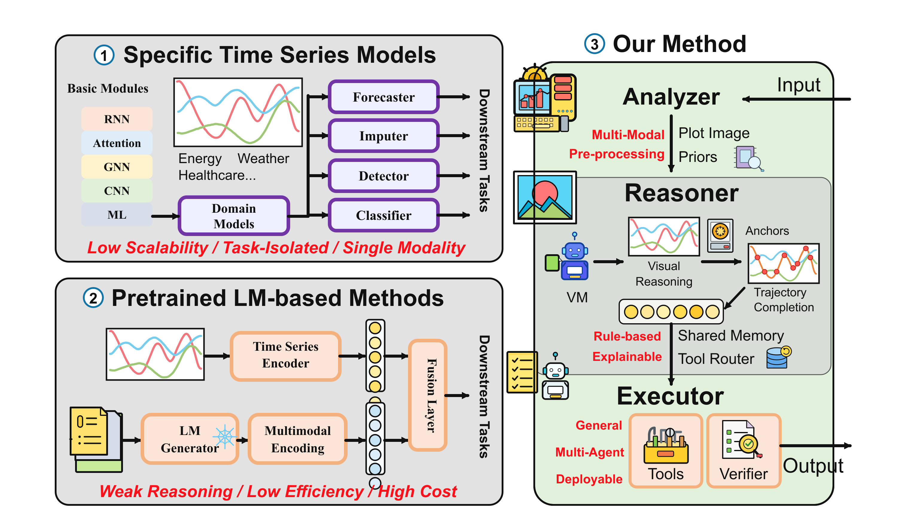
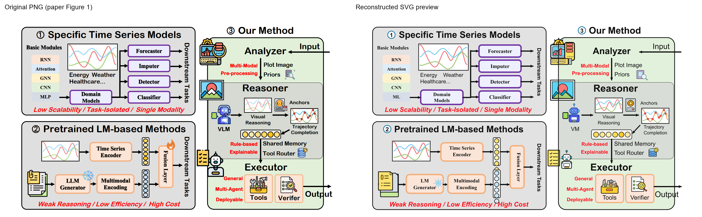

# PNG to SVG Reconstruction

A reusable Codex skill for rebuilding scientific diagrams, flowcharts, and technical schematics as faithful, editable SVGs.

The workflow inventories the source figure, redraws it as vector elements, checks text and mathematical notation, calibrates curves and arrows, and compares the rendered result against the source. It keeps an editable SVG master and can also deliver an outlined-text copy for font-independent sharing.

## Use in Codex

Invoke the skill with `$png-to-svg-reconstruction` and attach a diagram. The skill instructions are in [`SKILL.md`](SKILL.md); detailed reconstruction and verification notes are linked from that file.

To install manually, copy this folder into your Codex skills directory, usually `~/.codex/skills/png-to-svg-reconstruction` on macOS/Linux or `%USERPROFILE%\.codex\skills\png-to-svg-reconstruction` on Windows. Restart or refresh Codex if the skill list does not update.

## Included tools

- `scripts/audit_svg.py`: checks SVG structure, local references, external resources, optional text inventory, and editable/outlined mode. Requires Python 3.9 or newer; uses only the standard library.
- `scripts/render_svg.cjs`: writes a PNG preview using an existing Node.js and Sharp installation. It does not install packages.
- `scripts/make_comparison.py`: creates an offline source-PNG/SVG slider for visual review. The HTML contains both images, so it contains the source figure; the SVG itself remains independent.

See [`references/verification.md`](references/verification.md) for examples and tool limitations. Automated checks do not certify visual fidelity; compare the actual render and source at full size and in enlarged crops.

## Example reconstruction

The [`examples/our-methods/`](examples/our-methods/) directory contains a complete reconstruction of a three-part time-series methods framework. It preserves the panel hierarchy, 56 text runs, colored curves, arrows, and the small analyzer/reasoner/executor icons as native SVG elements.

- Original source figure: [`source.png`](examples/our-methods/source.png)
- Static original-versus-SVG comparison: [`comparison.png`](examples/our-methods/comparison.png)
- Interactive original/SVG comparison: [`comparison.html`](examples/our-methods/comparison.html) (self-contained offline slider; download and open in a browser; the static PNG above is visible inline in repository viewers)
- Editable master: [`diagram_editable.svg`](examples/our-methods/diagram_editable.svg)
- Font-independent outlined copy: [`diagram_outlined.svg`](examples/our-methods/diagram_outlined.svg)
- Text and visual inventory: [`inventory.json`](examples/our-methods/inventory.json)
- Structural audit reports: [`editable_audit.json`](examples/our-methods/editable_audit.json) and [`outlined_audit.json`](examples/our-methods/outlined_audit.json)
- Canvas: `1511 × 877`; embedded raster images: `0`
- Skill used: `$png-to-svg-reconstruction`
- Model: `GPT-5.6 Luna`
- Reasoning depth: `Max`

Source attribution: Weilin Ruan and Yuxuan Liang, “Visual Reasoning over Time Series via Multi-Agent System,” arXiv:2602.03026v1 (2026), Figure 1. See the [arXiv preprint](https://arxiv.org/abs/2602.03026) and the [CC BY 4.0 license](https://creativecommons.org/licenses/by/4.0/). The SVG is an adapted, redrawn derivative; the original figure is included for comparison and attribution.

The generated SVGs are the reusable artifacts; use the editable master when labels or geometry need to be changed.

## Additional case (reference only): BatteryTSFM

- Model: `GPT-6 Astra`
- Reasoning depth: `Ultra`
- Source: Fig. 2 in Zimeng Fan et al., “BatteryTSFM: Generalizable long-horizon degradation prediction across conditions and chemistries via time series foundation models,” *Energy and AI*, 22 (2025), 100646. [Article / DOI](https://doi.org/10.1016/j.egyai.2025.100646)
- The article is identified as CC BY-NC-ND 4.0. This repository records the citation and reconstruction settings only; it does not redistribute the paper figure, comparison image, or reconstructed SVG. See the [license terms](https://creativecommons.org/licenses/by-nc-nd/4.0/).

## Scope

The skill focuses on diagrams where preserving labels, formulas, curves, arrows, and small symbols matters. It is not intended for photographs or wrapping a raster image inside an SVG. User source images are not committed by default; this example includes its cited source figure solely to make the reconstruction comparison reproducible.
